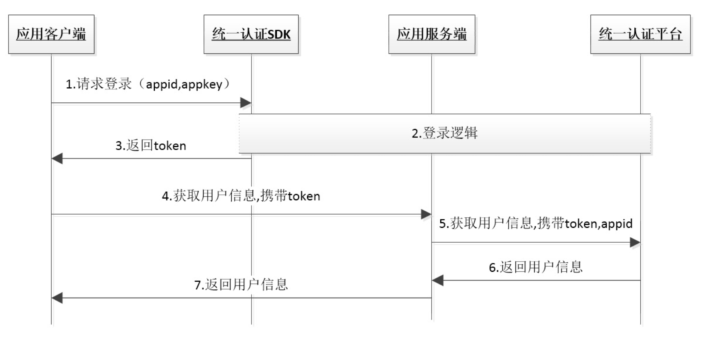

# 1. 开发环境配置 

**注：SDK在首次获取token过程中，用户手机必须在打开数据网络情况下才能成功，纯wifi环境下只能使用短信验证码登录。**</br>

## 1.1. 环境配置及发布

1. 导入统一认证framework，直接将统一认证`TYRZSDK.framework`拖到项目中。
2. 在Xcode中找到`TARGETS-->Build Setting-->Linking-->Other Linker Flags`在这选项中需要添加`-ObjC`和`-all_load`。
</br>

## 1.2. Hello 统一认证 

本节内容主要面向新接入统一认证的开发者，介绍快速集成统一认证的基本服务的方法。

### 1.2.1. 统一认证登录流程



由流程图可知，业务客户端集成SDK后只需要完成2步集成实现登录：

    1.	调用登录接口获取token
    2.	携带token请求登录

</br>

### 1.2.2. 统一认证登录集成步骤

**第一步：**

在`appDelegate.m`中的`didFinish`函数中添加初始化代码。初始化代码只需要执行一次就可以。

```objective-c
- (BOOL)application:(UIApplication *)application didFinishLaunchingWithOptions:(NSDictionary *)launchOptions {
     [UASDKLogin initializeWithAppId:APPID appKey:APPKEY];//初始化appid和appkey
     [UASDKLogin printConsoleEnable:YES];//打开调试日志，默认关闭
     //[UASDKLogin middleWarePriorityShouldFirst:NO];//需要关闭中间件优先登录时设置，默认为使用YES
    return YES;
}
```

##1.3. 如何使用单点登录

业务A在使用单点登录到业务B时，需要先使用隐式登录/短信验证码登录获取token，再将token传递到业务B，由业务B带着token去换取业务A使用者的用户手机号码，完成单点登录流程。

<div STYLE="page-break-after: always;"></div>

#2. SDK方法说明

## 2.1. 初始化appid和appkey

### 2.1.1. 方法描述

**功能**

该方法用于初始化appid、appkey，必须要在Appdelegate调用。

**原型**

```objective-c
+ (void)initializeWithAppId:(NSString *)appId appKey:(NSString *)appKey;
```

</br>

### 2.1.2. 参数说明

**请求参数**


| 参数     | 类型       | 说明       | 是否必填 |
| ------ | -------- | -------- | ---- |
| appId  | NSString | 应用的appid | 是    |
| appKey | NSString | 应用密钥     | 是    |


**响应参数**

无

</br>

### 2.1.3. 示例

**请求示例代码**

```objective-c
[UASDKLogin initializeWithAppId:APPID appKey:APPKEY];
```

**响应示例代码**

无


</br>

## 2.2. 预取号

### 2.2.1. 方法描述

**功能**

该方法用于隐式登录前，可以通过预取号方法提前获取用户信息并缓存，且只缓存网关缓存不缓存短信验证码缓存。若当前已缓存短信验证码缓存，再调用此方法则会清除已有的短信验证码缓存，重新走网关取号并缓存。该方法为非必要调用方法，缓存信息的有效时间是5min并且只能使用一次。用户可在网关隐式登录前调用，登录时会优先使用缓存信息以减少获取token总时长，从而可提高登录速度。

</br>

**原型**

`UASDKLogin -- preGetPhonenumber `

```objective-c
+ (void)preGetPhonenumber:(void (^)(id sender))complete;
```

</br>

### 2.2.2. 参数说明

**请求参数**

| 参数     | 类型   | 说明                                       | 是否必填   |
| ------ | ---- | ---------------------------------------- | ------ |
| complete |block | 预取号结果回调 | 是</br> |

**响应参数**

| 参数         | 类型         | 说明       | 是否必填 |
| ---------- | ---------- | -------- | ---- |
| resultCode | NSUinteger | 返回相应的结果码 | 是    |
| desc | NSString   | 结果码描述     | 是    |
| securityphone | NSString | 手机掩码 | 成功时必填|
| openId       | NSString   | 用户唯一标识符     | 成功时必填|
| loginMethod | NSString | 方法描述 | 是   |
|operator | NSString | 运营商类型 0:未知 1：中国移动 2：中国联通，3：中国电信| 成功时必填   |
| traceId | NSString | 接口调用id | 接口调用失败时返回   |
</br>

### 2.2.3. 示例

**请求示例代码**

```objective-c
[UASDKLogin preGetPhonenumber:^(id sender) {
    //处理回调结果
}];
```


**响应示例代码**

```
{
"resultCode": "103000",//返回码
"desc": "预取号成功",//返回码描述
"securityphone": "138****5380",//手机号掩码
"openId": "9M7RaoZH1Z23Gw0ll_nuIE6D7qDjEmjnj_DXARN1JObalKy3Uygg",
"loginMethod": "preGetPhonenumber",
"operator": "1"
}
```


</br>


## 2.3. 隐式登录

### 2.3.1. 方法描述

**功能**

该方法用于token校验实现获取手机号码功能。使用该方法获取到的token，可通过`获取用户信息接口`来获取手机号码等用户信息。该方法优先判断中间件开关，若中间件开关打开且存在有效中间件缓存优先中间件（网关或短信验证码）缓存登录，次之有预取号缓存走预取号缓存登录，否则走网关取号登录。如果业务A需要做单点登录时，也可使用该方法获得token后，再将token传递到业务B，由业务B带着token去换取业务A使用者的用户手机号码，完成单点登录流程。</br>

**原型**

`UASDKLogin -- getTokenImpWithComplete:`

```objective-c
+ (void)getTokenImpWithComplete:(void (^)(id sender))complete
```

### 2.3.2 参数说明

**请求参数**

无

</br>

**响应参数**

| 参数        | 类型     | 说明                                                         | 是否必填   |
| ----------- | -------- | ------------------------------------------------------------ | ---------- |
| resultCode  | NSString | 返回相应的结果码                                             | 是         |
| desc | NSString   | 结果码描述     | 是    |
| token       | NSString | 成功时返回：临时凭证，token有效期2min，一次有效，同一用户（手机号）10分钟内获取token且未使用的数量不超过30个 | 成功时必填 |
| authType    | NSString | 认证类型：</br>0:其他;</br>1:WiFi下网关鉴权;</br>2:网关鉴权;</br>4: WIFI下网关鉴权复用中间件登录;</br>5: 网关鉴权复用中间件登录;</br>7:短信验证码登录 | 成功时必填 |
| authTypeDes | NSString | 认证类型描述，对应authType                                   | 成功时必填 |
| OpenID      | NSString | 用户身份唯一标识 | 成功返回   |
| passid      | NSString | 统一账号系统标识 | 成功返回   |
| traceId | NSString | 接口调用id | 接口调用失败时返回   |

</br>

### 2.3.3. 示例

**请求示例代码**

```objective-c
[UASDKLogin getTokenImpWithComplete:^(id sender) {
    //登录逻辑处理
}];
```


**响应示例代码**

```
{
    authType = 2;
    authTypeDes = "网关鉴权复用中间件登录";
    desc = "隐式登录成功";
    openId = "007KlCV41GU0WwB_pW6B4sMQL2kYj_bM-P3HEFl-EcLx4cisMYfE";
    passid = "668568390";
    resultCode = 103000;
    token = 84840100013302000130030002353004003C4D7A524452455643526A6B774E4549794F5552454D44684540687474703A2F2F3132302E3139372E3233352E32373A383038302F746573742F403031050004018B95F80600063130303030300700206233363839343039333639373465393639643461386334363233306166643532FF0020F7D5F4D7E49BE6C59184B62341F85929C56C9D5CF1900526F940F75B3FD6E821;
}
```

</br>

## 2.4. 获取短信验证码

### 2.4.1. 方法描述

**功能**

该方法用于短信验证码登录获取token时，通过输入手机号码来获取对应的短信验证码。目前只支持移动和电信手机号。

</br>

**原型**

`UASDKLogin -- getSmsCodeWithPhoneNumber `

```objective-c
+ (void)getSmsCodeWithPhoneNumber:(NSString *)phoneNumber complete:(void(^)(id sender))complete;
```

</br>

### 2.4.2. 参数说明

**请求参数**

| 参数     | 类型   | 说明                                       | 是否必填   |
| ------ | ---- | ---------------------------------------- | ------ |
|phoneNumber |NSString | 用户的手机号码 | 是</br> |

**响应参数**

| 参数       | 类型     | 说明             | 是否必填   |
| ---------- | -------- | ---------------- | ---------- |
| resultCode | NSString | 返回相应的结果码 | 是         |
| desc       | NSString | 返回结果描述     | 成功时必填 |
| traceId | NSString | 接口调用id | 接口调用失败时返回   |
</br>

### 2.4.3. 示例

**请求示例代码**

```objective-c
[UASDKLogin getSmsCodeWithPhoneNumber:phoneNum complete:^(id sender) {
}];
```

**响应示例代码**

```
{
    desc = "获取短信验证码成功";
    resultCode = 103000;
}
```
</br>

## 2.5. 短信验证码登录

### 2.5.1. 方法描述

**功能**

该方法用于短信验证码登录，用户应先调用获取短信验证码接口，等待手机接收到短信验证码，然后再调用此方法将短信验证码和手机号码作为参数传进来，即可完成短信验证码的登录。</br>

**注：短信验证码登录后会有缓存（不建议使用，如果使用出现安全问题由业务方负责），建议在成功后可在返回码为`103000`时调用`cleanSSOSync`方法清除缓存即可。**

**原型**

`UASDKLogin -- getTokenBySmsCodewithPhoneNumber `

```objective-c
+ (void)getTokenBySmsCodewithPhoneNumber:(NSString *)phoneNumber smsCode:(NSString *)smsCode  complete:(void(^)(id sender))complete;
```

</br>

### 2.5.2. 参数说明

**请求参数**

| 参数     | 类型   | 说明                                       | 是否必填   |
| ------ | ---- | ---------------------------------------- | ------ |
|phoneNumber |NSString | 用户的手机号码 | 是</br> |
|smsCode |NSString | 手机验证码 | 是</br> |

**响应参数**

| 参数        | 类型     | 说明                                                         | 是否必填   |
| ----------- | -------- | ------------------------------------------------------------ | ---------- |
| resultCode  | NSString | 返回相应的结果码                                             | 是         |
| token       | NSString| 成功时返回：临时凭证，token有效期2min，一次有效，同一用户（手机号）10分钟内获取token且未使用的数量不超过30个 | 成功时必填 |
| authType    | NSString | 认证类型：7:短信验证码登录 | 成功时必填 |
| authTypeDes | NSString | 认证类型描述，对应authType                                   | 成功时必填 |
| OpenID      | NSString | 用户身份唯一标识（参数需在开放平台勾选相关能力后开放，如果勾选了一键登录能力，使用本方法时，不返回OpenID） | 成功返回   |
| passid      | NSString | 统一账号系统标识 | 成功返回   |
| traceId | NSString | 接口调用id | 接口调用失败时返回   |
</br>

### 2.5.3. 示例

**请求示例代码**

```objective-c
[UASDKLogin getTokenBySmsCodewithPhoneNumber:phoneNum smsCode:smsCode complete:^(id sender) {
        NSString *resultCode = sender[UAResultCode];
        if([resultCode isEqualToString:@"103000"]){
         //[UASDKLogin cleanSSOSync];//如不需要缓存，可清理短信验证码登录缓存
        }
}];
```


**响应示例代码**

```
{
    authType = 7;
    authTypeDes = "短信验证码登录";
    openId = "TddPLEIu1bG5jaPLfc1IxuOqDnZJa7dXhAnIcUOG_sqymDFoBowA";
    passid = "668568390";
    resultCode = 103000;
    token = 84840100013602003A4E444A474D6A424451305135515559354D5468434D304A4440687474703A2F2F3132302E3139372E3233352E32373A383038302F72732F4030320300040555189D040012383030313230313730383036313030393533050020623336383934303933363937346539363964346138633436323330616664353206000132070003323030FF002096E3021565A620381ACBCECB7DD5C90C0689D9BC1CA2DD8E3E5119AF7BD796A7;
}
```

</br>

## 2.6. 是否中间件优先登录

### 2.6.1. 方法描述

**功能**

该方法控制隐式登录时是否优先使用中间件登录，默认为YES。如果传入YES，则每次登录时都会先检查是否已经有中间件，如果有则使用上次登录的中间件登录，否则按照无中间件正常流程登录。如果传入NO，则不使用中间件登录，不会使用缓存中间件信息。

</br>

**中间件是什么？**

`为了减少应用在登录或做单点登录时，频繁做网关取号操作，减少取号失败概率，应用首次登录时，SDK会将用户加密的登录信息保存在本地，称为中间件。中间件会在用户每天首次登录/单点登录时会去访问服务端判断是否失效；服务端中间件有效期30天；服务端中间件失效后，用户登录或使用单点登录时，将需要重新走网关取号流程。`

**注：若middleWarePriorityShouldFirst为YES，假设上次登录的手机号码是A，当用户手机换sim卡之后，再次登录，可能获取到的手机号码还是A，因为SDK无法检测用户手机换卡事件，所以使用的还是手机号码A的缓存。如果要彻底解决该缓存问题，可以设置为NO。或者通过一些产品的手段引导用户换卡之后调用cleanSSOSync方法清除中间件，此时会重新取号。**


</br>

**原型**

`UASDKLogin -- middleWarePriorityShouldFirst `

```objective-c
+ (void)middleWarePriorityShouldFirst:(BOOL)flag;
```

</br>

### 2.6.2. 参数说明

**请求参数**

| 参数     | 类型   | 说明                                       | 是否必填   |
| ------ | ---- | ---------------------------------------- | ------ |
|flag |BOOL | 是否中间件优先登录 | 是</br> |

**响应参数**

无

</br>

### 2.6.3. 示例

**请求示例代码**

```objective-c
[UASDKLogin middleWarePriorityShouldFirst:YES];
```


**响应示例代码**

无

</br>

## 2.7. 清除中间件缓存信息

### 2.7.1. 方法描述

**功能**

该方法用于清除中间件缓存信息，当用户不想使用中间件信息进行登录或者用户换了另外的sim卡的时候，可以使用该方法将中间件信息清除，然后再进行登录操作。中间件清除后，用户再次登录时，将走网关/短信逻辑重新取号。

**注：建议业务APP在调用uniTokenValidate接口获取用户信息的时候，如果该接口的返回码不是103000，都调用一下cleanSSOSync方法清除中间件来提高用户登录的成功率。**

**原型**

`UASDKLogin -- cleanSSOSync `

```objective-c
+ (BOOL)cleanSSOSync;
```

</br>

### 2.7.2. 参数说明

**请求参数**

无

**响应参数**


| 参数     | 类型   | 说明                                       | 是否必填   |
| ------ | ---- | ---------------------------------------- | ------ |
|无 |BOOL | 清除中间件信息是否成功 | 是</br> |

</br>

### 2.7.3. 示例

**请求示例代码**

```objective-c
[UASDKLogin cleanSSOSync];
```


**响应示例代码**

无

</br>

## 2.8. 打印调试日志
### 2.8.1. 方法描述

**功能**

该方法用于打印SDK相关调试日志，方便开发者接入调试并查看问题。

**原型**
`UASDKLogin -- printConsoleEnable `
``` objective-c
+ (void)printConsoleEnable:(BOOL)enable;
```
</br>
### 2.8.2. 参数说明

**请求参数**

无

**响应参数**


| 参数     | 类型   | 说明                                       | 是否必填   |
| ------ | ---- | ---------------------------------------- | ------ |
|无 |BOOL | 是否需要调试打印 | 是</br> |

</br>
### 2.8.3. 示例

**请求示例代码**

``` objective-c
[UASDKLogin printConsoleEnable:YES];
```
**响应示例代码**

无

</br>

## 2.9. 获取SDK版本号

### 2.9.1. 方法描述

**功能**

该方法供接入方区分SDK的版本号，便于反馈SDK的相关信息。

**原型**

``` objective-c
@property (nonatomic,class,readonly) NSString *sdkVersion;
```
### 2.9.2. 示例
**请求调用示例**

``` objective-c
NSString *sdkVersion = UASDKLogin.sdkVersion;
```

<div STYLE="page-break-after: always;"></div>

# 3. 平台接口说明

## 3.1. 获取用户信息接口

业务平台或服务端携带用户授权成功后的token来调用统一认证服务端获取用户手机号码等信息。</br>
**注：本接口仅适用于5.4.0及以上版本SDK。**

### 3.1.1. 业务流程

SDK在获取token过程中，用户手机必须在打开数据网络情况下才能获取成功，纯wifi环境下会自动跳转到SDK的短信验证码页面（如果有配置）或者返回错误码。


### 3.1.2. 接口说明

**生产环境请求地址：**
 
https://token.cmpassport.com:8300/uniapi/uniTokenValidate

**协议：** HTTPS+ application/json

**请求方法：** POST+json

</br>


### 3.1.3. 参数说明

**请求参数**

| 参数名称            | 约束 | 层级 | 参数类型 | 说明                                                         |
| ------------------- | ---- | ---- | -------- | ------------------------------------------------------------ |
| header              | 必选 | 1    |          |                                                              |
| version             | 必选 | 2    | string   | 填1.0                                                        |
| msgid               | 必选 | 2    | string   | 标识请求的随机数即可(1-36位)                                 |
| systemtime          | 必选 | 2    | string   | 请求消息发送的系统时间，精确到毫秒，共17位，格式：20121227180001165 |
| id                  | 必选 | 2    | string   |业务或应用集成统一认证的标识，需提前申请，申请指南见附录B 即：sourceId或appId。临时凭证校验时，id必须为sourceid                        |
| idtype              | 必选 | 2    | string   | id类型：0：sourceid 1:appid。临时凭证校验时，idtype必须为0                          |
| apptype             | 必选 | 2    | string   | 参见“渠道编码定义”：1:BOSS</br> 2:web</br> 3:wap</br> 4:pc客户端</br> 5:手机客户端 |
| userip              | 可选 | 2    | string   | 客户端用户来源ip                                             |
| message             | 可选 | 2    | string   | 接入方预留参数，该参数会透传给通知接口，此参数需urlencode编码 |
| expandparams        | 可选 | 2    | json     | 业务扩展参数，多个参数以`|`分隔，每个参数长度为3字节，例如：300`|`301。300: sdk签发的token和临时凭证校验成功返回uid                                     |
| sign                | 必选 | 2    | string   | 签名，MD5(apptype  +id+idtype+key+msgid+ systemtime+token+version)，输出32位小写字母+数字,其中，key为appkey或sourcekey,由idtype确定。id为sourceid且sourcekey不存在的情况，key为空，建议通过认证平台申请sourcekey以提高安全性。**（注：“+”号为合并意思，不包含在被加密的字符串中,appkey为秘钥, 参数名做自然排序（Java是用TreeMap进行的自然排序））**可参考附录D的示例代码Sign.java。 |
| body                | 必选 | 1    |          |                                                              |
| token               | 必选 | 2    | string   | 需要解析的凭证值。                                           |
| userInformation               | jssdk token校验时必填  | 2    | string   |加密的浏览器指纹，智能认证jssdk token校验时必填，其他token校验时不填                                           |

</br>

**响应参数**

| 参数名称            | 约束 | 层级 | 参数类型 | 说明                                                         |
| ------------------- | ---- | ---- | -------- | ------------------------------------------------------------ |
| header              | 必选 | 1    |          |                                                              |
| version             | 必选 | 2    | string   | 1.0有升级时调整                                              |
| inresponseto        | 必选 | 2    | string   | 对应的请求消息中的msgid                                      |
| systemtime          | 必选 | 2    | string   | 响应消息发送的系统时间，精确到毫秒，共17位，格式：20121227180001165 |
| resultcode          | 必选 | 2    | string   | 返回码，返回码对应说明见附录A                                |
| resultdesc          | 必选 | 2    | string   | 返回结果描述信息。                                |
| body                | 必选 | 1    |          |                                                              |
| msisdntype          | 可选 | 2    | string   | 手机号码的归属运营商：</br> 0：中国移动</br>1：中国电信</br>2：中国联通</br> 99：未知的异网手机号码 |
| usessionid          | 可选 | 2    | string   | 基于uid的token校验成功后，该字段为uid                                                     |
| msisdnmask          | 可选 | 2    | string   | 手机号码掩码，如：138****1234                                                    |
| passid              | 必选（校验融合sdk token时，为可选） | 2    | string   | 用户统一账号的系统标识                                       |
|openid              | 可选 | 2    | string   | 用户对外身份标识                                      |
|email              | 可选 | 2    | string   | 表示邮箱地址 
|loginid              | 必选 | 2    | string   | 咪咕token校验时必选。用户登录时，输入的用户名，可以有三种类型：</br>0：手机号码</br>1：邮箱</br>2：普通用户名（字母数字组合）</br>3：第三方账号唯一标识，QQ/微信为unoinid，其他为openid                                      |
| loginidtype         | 可选 | 2    | string   | 登录使用的用户标识：</br>0：手机号码</br>1：邮箱</br>2：普通用户名（字母数字组合）</br>3: 第三方账号（QQ/微信/支付宝/新浪微博）                                                         |
| msisdntype         | 可选 | 2    | string   | 手机号码的归属运营商：</br>0：中国移动</br>1：中国电信</br>2：中国联通</br>99：未知的异网手机号码|
| province            | 可选 | 2    | string   | 用户所属省份(暂无)                                                    |
| authtype            | 可选 | 2    | string   | 认证方式,具体取值参考附录C                                                    |
| authtime            | 可选 | 2    | string   | 统一认证平台认证用户的时间                                                   |
| relateToAndPassport | 可选 | 2    | string   | 是否已经关联到统一账号，暂无用处                             |
| relateToMiguPassport | 可选 | 2    | string   | 用户在本业务平台的账号是否已经关联到咪咕账号，若已关联，与咪咕账号中手机/邮箱相同的业务账号不能再登录。咪咕token校验时必选</br>0：已经关联</br>1：未关联                            |
| msisdn              | 可选 | 2    | string   | 手机号码经过AES加密后的结果,密钥为appkey或sourceKey经md5转换后的值。如果appkey或sourceKey不存在，则返回明文，建议通过认证平台申请sourceKey以提高安全性。可使用参考附录E中的deCodeAES()进行解密                                      |
| implicit            | 可选 | 2    | string   | 是否为隐式咪咕账号，咪咕token校验时必选</br>0：不是</br>1：是                                                   |
| fromid            | 可选 | 2    | string   | 来源sourceid或appid（即签发token的sourceid或appid）                                                 |
| fromidtype            | 可选 | 2    | string   | 来源sourceid或appid类型0：sourceid 1:appid                                                |
| toid            | 可选 | 2    | string   | 来源目标sourceid或appid（即签发token的sourceid或appid）                                                 |
| toidtype            | 可选 | 2    | string   | 目标sourceid或appid（即签发token的sourceid或appid）                                                |
| message            | 可选 | 2    | string   | 接入方预留参数，此参数需urlencode编码                                               |
| userid            | 可选 | 2    | string   | 临时凭证校验响应字段，用户内部标识                                               |
| nickname            | 可选 | 2    | string   | 昵称                                                |
| lastchangetime            | 可选 | 2    | string   |临时凭证校验响应字段，通行证信息最后一次更新时间，精确到毫秒，共17位，格式：20121227180001165                                                |
| exresparams            | 可选 | 2    | string   | 响应扩展参数，多个参数以`|`分隔，顺序与请求扩展参数对应，例如：key1=value1`|`key2=value2`|`uid=...|


</br>

### 3.1.4. 示例

**请求示例**

```
{
	"header": {
		"version": "1.0",
		"msgid": "1533635625757",
		"systemtime": "20180807175345757",
		"id": "012005",
		"idtype": "0",
		"apptype": "3",
		"sign": "dc090d3c24959d42b56691ba424dfb65"
	},
	"body": {
		"token": "8484010001320200344E6A5A4551554D784F444E474E446C434E446779517A673340687474703A2F2F3139322E3136382E31322E3233363A393039302F0300040353EA68040006313030303030FF00203A020A143C6703D7D0530953C760744C7D61F5F7B546F12BC17D65254878748C"
	}
}
```

**备注：示例中的token不会过期，可重复使用，可以用于验证调用流程。正式的token只能使用一次。但使用示例中的token时，无法通过传递扩展参数获取uid。**

**响应示例**

```
{
	"header": {
		"inresponseto": "1533635625757",
		"resultcode": "103000",
		"systemtime": "20180807175344658",
		"version": "1.0",
		"resultdesc": "成功(103000)"
	},
	"body": {
		"msisdntype": "0",
		"toid": "012005",
		"passid": "000000000",
		"fromid": "100000",
		"lastactivetime": "",
		"authtype": "WAPGW",
		"toidtype": "0",
		"fromidtype": "0",
		"usessionid": "NjZEQUMxODNGNDlCNDgyQzg3@http://192.168.12.236:9090/@06",
		"msisdnmask": "188****0000",
		"loginidtype": "0",
		"authtime": "2018-08-07 17:53:44",
		"msisdn": "nvBSIzynspuOFuLZYX4nJQ==",
		"relateToAndPassport": "1"
	}
}
```

<div STYLE="page-break-after: always;"></div>

# 4. 返回码说明

## 4.1. SDK返回码

使用SDK时，SDK会在认证结束后将结果回调给开发者，其中结果为JSONObject对象，其中resultCode为结果响应码，103000代表成功，其他为失败。成功时在根据token字段取出身份标识。失败时根据resultCode定位失败原因。

| 错误码 | 返回错误码的描述                                             |解决办法|
| ------ | -------------------------------------------------------|---------|
| 103000 | 通用 成功返回                                                 |
| 103102 | 错误的请求包签名                                                 |工程配置的boundid与平台申请的不一致
| 105002 | 获取移动手机号码失败                                                 |
| 105013 | 不支持联通取号                                                 |
| 105300 | 短信验证码请求过于频繁                                                 |当天获取验证码次数超限
| 105301 | 短信验证码错误或已失效                                                 |
| 200002 | 没有sim卡|
| 200014 | 手机号码格式错误                                             |
| 200015 | 短信验证码格式错误                                           |
| 200021 | 数据解析异常                                                 |一般是由于网络异常造成的，检查一下移动网络是否正常，联通卡或者电信出现此错误的概率比较高 |
| 200022 | 无网络状态                                                   |
| 200023 | 请求超时                                                     |
| 200027 | 预取号只开启WIFI                                             |打开手机的移动网络并且检查APP是否有访问移动的权限 |
| 200028 | 网络请求出错                                                 |
| 200029 | 请求出错,上次请求未完成                                      |一般是由于接入方频繁调用了SDK接口，而上一次请求还未完成，请检查代码逻辑，等待上次操作完成再执行下次操作|
| 200030 | 没有初始化参数                                               |调用SDK的获取token方法之前请先调用SDK的初始化方法|
| 200031 | 生成token失败                                                |
| 200032 | KS缓存不存在                                                 |中间件数据被破坏，重新调用获取token方法即可|
|200050  | Socket创建或发送接收数据失败 | |
|200059  | 无网络的情况下解析主机失败 | |
|200064  | 服务端返回数据异常 | |
|200072  | CA根证书校验失败 | |
|200082  | 服务器返回不支持的登录方式 | |
|200088  | sourceid为空 |重新调用获取token方法即可 |

## 4.2. 获取用户信息接口返回码

| 平台错误码 | 描述                                       |   解决办法  |   
| ---------- | ------------------------------------------ |---------|
| 103000     | 通用 成功返回                               |
| 103101     | 签名错误(token信息不对)                    |将接口换成生成环境的接口，并且发送参数idtype的值填0,id的值填sourceid|
| 103102     | 包签名错误                                 |请确认是否已经发送邮件添加了白名单配置。
| 103112     | 错误的请求                                 |
| 103113     | token内容错误                              |重新获取一次token
| 103114     | token验证 KS过期                           | 调用SDK清除缓存方法重新获取token|
| 103115     | token验证 KS不存在                         | 调用SDK清除缓存方法重新获取token|
| 103116     | token重复校验                          |token只能验证一次，不能多次校验，请重新获取token再校验|
| 103117     | mac异常                                    |调用SDK清除缓存方法重新获取token
| 103118     | sourceid不存在                             |检查sourcid是否正确|
| 103119     | appid不存在                                |检查appid是否正确，或者将参数id的值填sourceid，idtype的值填0|
| 103120     | clientauth不存在                           |调用SDK清除缓存方法重新获取token
| 103121     | passid不存在                               |调用SDK清除缓存方法重新获取token
| 103122     | btid不存在                                 |调用SDK清除缓存方法重新获取token
| 103133     | sourceid不合法                             |
| 103137     | 请求其他平台token验证接口异常          |
| 103211     | 其他错误                                 |
| 103226     | sqn错误                              |重新获取TOKEN
| 103412     | 无效的请求                                 |
| 103414     | 参数校验异常                                  |请求报文格式错误
| 103614     | 登录回话不存在或已过期                                  |调用SDK清除缓存方法重新获取token
| 103810     | 校验失败，接口token版本不一致          |
| 103811     | token为空          |
| 104201     | 􏰗􏰔􏰏􏰑􏰕􏳤􏴪􏰧􏱥􏴩􏱏􏰗􏰔􏰏􏰑􏰕􏳤􏴪􏰧􏱥􏴩􏱏token失效或不存在          |
| 105018     | 用户权限不足                               |
| 105019     | 应用未授权                                 |将发送参数id的值改成sourceid，idtype改成0|


